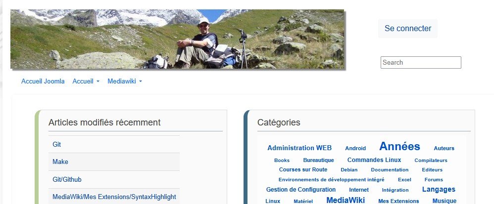

# MediawikiBootstrap5
This is a MediaWiki skin that uses Bootstrap 5 from Twitter! 

## Features
* Mediawiki skin that uses [bootstrap 5][1]
* uses mediawiki SkinMustache
* Customizable menu and icon footer

 

## Latest Version
* 1.1.2 : compatible with MediaWiki 1.42.3
    
Download the latest [release here][2]. For a full version history go to [here][3].

## Installation
### Download
Download a [release version][2] and untar the tarball into your skins directory
or 
```
git clone git@github.com:JLTRY/mediawikibootstrap5.git
```

Next, in `LocalSettings.php` set:

```php
wfLoadSkin('MediaWikiBootstrap5');
$wgDefaultSkin = 'mediawikibootstrap5';
```

### dependencies
To bootstrap5 and jquery
In `composer.local.json` set:
```json
{
	"require": {        
		"twbs/bootstrap": "5.1.3",
		"components/jquery": "3.6.0"
	}
}
```

### customize your skin
#### Create: 'MediaWikiBootstrap:TitleBar'
This MediaWiki page will contain items that will appear in your Menu. 
 I've set mine to the following:

```
* [http://www.jltryoen.fr  Accueil Joomla]
* Accueil
** [[Wiki|Accueil]]
** [[Plan du site]]
* Mediawiki
** [[Mediawiki|Install MediaWiki]]
** [[Aide:Accueil|Aide]]
```
#### Create: 'MediaWikiBootstrap:FooterLinks' and 'MediaWikiBootstrap:FooterTexts
This will appear at the bottom of your site

I have set mine to the following
```
* [[FAQ_de_JLT:À_propos_de|À propos de la FAQ de JLT]]
* [[Spécial:Contact|Contact]]

'<b>© 2011-2024</b> La FAQ de JLT'
```

[1]: https://getbootstrap.com/docs/5.0/getting-started/introduction/
[2]: https://github.com/JLTRY/mediawikibootstrap/releases/tag/V1.1.0
[3]: https://github.com/JLTRY/mediawikibootstrap/
